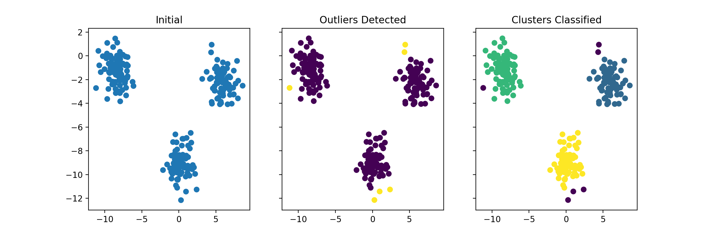

# dbscan

Python implementation of **DBSCAN** algorithm from scratch. Complete for **outlier detection** and point classification (core, border, noise). Work in progress on cluster classification (separating one cluster from another). 

